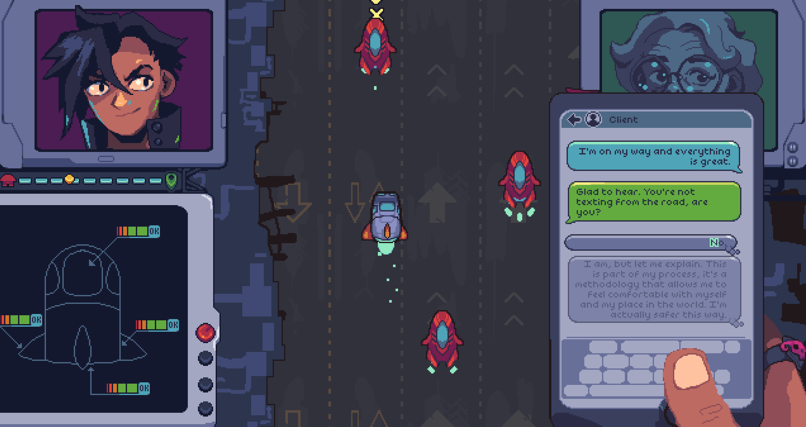

<h1 align="center">A game made by Murder Engine</h1>

This is the source repository for the "Neo City Express", an entry for Ludum Dare 53.

### How can I play it?
We have an [itch.io page](https://saint11.itch.io/neo-city-express) where you can download the game. 

It currently runs on Windows, Linux and macOS.

### How to build it?
Unfortunately, you can't build from this repo (yet), since this games depends on Murder Engine. We intend to release the engine once it's more stable, as we have been done tons of learnings and tweaks around it. I also removed the sounds, which rely on FMOD.

### Other tools!
The dialogue itself is written in [gum](https://github.com/isadorasophia/gum), a narrative language designed to integrate with the engine and all the logic is around an ECS supported by [bang](https://github.com/isadorasophia/bang), a C# ECS framework. The rendenring and graphics of the engine are pulled from Monogame, although we don't rely on any of the MonoGame Content Builder because it's not fast enough (we need to hot reload everything!).

Anyway, I hope this code helps on any references around ECS or the engine. Feel free to reach out on any questions!
