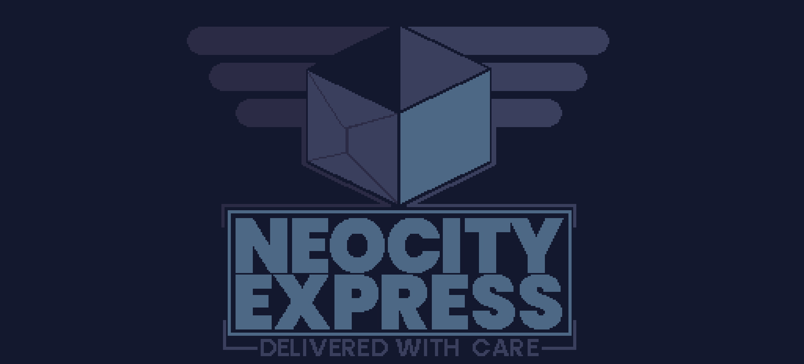

<p align="center">

</p>

<h1 align="center">A game made on Murder Engine</h1>

<p align="center">

</p>

This is the source repository for the "Neo City Express", an entry for Ludum Dare 53.

### How can I play it?
We have an [itch.io page](https://saint11.itch.io/neo-city-express) where you can download the game. 

It currently runs on Windows, Linux and macOS.

### How to build it?
SO I manually copied the engine binaries built with debug symbols. This is not ideal, but the engine is not ready to be public or shipped yet, so this is a compromise that I found to release this source without spending a week working on it.

BUT! You know what? The project builds! Back to business, the first step is that all you really need is [dotnet 7 SDK](https://dotnet.microsoft.com/en-us/download/dotnet/7.0) installed.

1. Building the editor 

_...on the terminal_
```
cd src/LDGame.Editor
dotnet build
```

_...on Visual Studio_ \
Open `LDGame.sln` on Visual Studio 2022, set `LDGame.Editor` as startup project and hit F5. 🎉

2. Building the game

_...on the terminal_
```
cd src/LDGame
dotnet build
```

_...on Visual Studio_ \
Set `LDGame` as startup project on the steps above.

Now, the sounds require fmod, which I am not really allowed to ship here. If you want to get sounds working, run the editor and **check the log error for instructions**. You can get the fmod binaries [here](https://www.fmod.com/download), under "Fmod Engine". You just manually add the assemblies on all the architectures you want to target (macOS, Windows, Linux).

### Other tools!
- The dialogue itself is written in [gum](https://github.com/isadorasophia/gum), a narrative language designed to integrate with the engine. You can try editing the gum files, they will automatically pick up the changes in the editor! 

- All the logic is around an ECS supported by [bang](https://github.com/isadorasophia/bang), a C# ECS framework. 

- The rendenring and graphics of the engine are pulled from Monogame, although we don't rely on any of the MonoGame Content Builder because it's not fast enough (we need to hot reload everything!).

Anyway, I hope this code helps on any references around ECS or on the engine. Feel free to reach out on any questions!

### Team
_Pedro Medeiros (@saint11)_ \
_Isadora Rodopoulos (me)_ \
_Davey Wreden (@HelloCakebread)_ \
_Ryan Roth (@DualRyan)_ \
_Voice Acting by Jack Hicks_

<p align="center">
<br>
</p>
